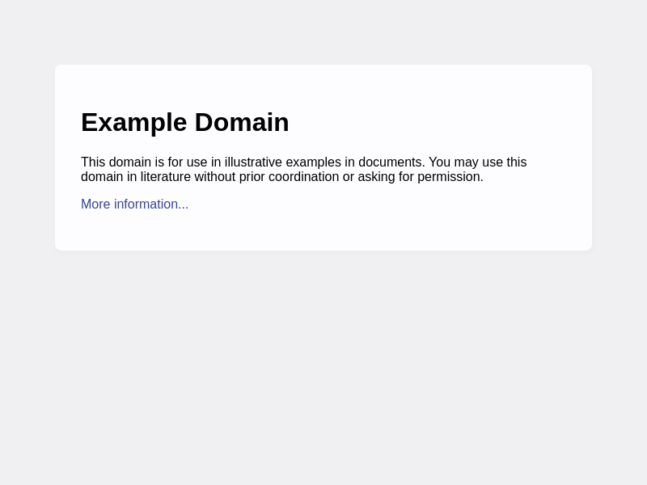

# pptraas

Puppeteer, exposed as a web service. Built with [Nixpacks](https://nixpacks.com/).

[](https://percy.io/dtinth/pptraas)

## Introduction

Setting up a service that integrates with Puppeteer is quite a challenge. For example:

- System dependencies
- Fonts (does it render text in language X properly?)
- Emojis
- Font smoothing

This project aims to solve these issues, expose a simple API, and package all of that into a Docker image that you can deploy into serverless container platforms (like [Google Cloud Run](https://cloud.google.com/run/) or [Azure Container Apps](https://azure.microsoft.com/en-us/pricing/details/container-apps/)) or just run on your own server.

## Building image

```bash
bin/build
```

## Running the image locally

```bash
bin/run
```

## Running the tests locally

The image must be running locally before running the tests.

```bash
node test.mjs
```

This will generate render output in the `.data/screenshots` directory.

## Usage

Make a `POST` request to the `/run` endpoint with the following JSON body:

- `code` (string): The Puppeteer script to run. It has access to the variable `page` which is a [Puppeteer `Page` object](https://pptr.dev/api/puppeteer.page). Note that `await` isn’t supported. If you want to use `await`, wrap it inside an immediately-invoked async function.
- `apiKey` (string): When running locally using the `bin/run` script, the API key is `dummy`.

If the function call results in a buffer, it will be returned directly. Otherwise, the result will be JSON-encoded and available as `result.data` in the response.

Example usage:

```bash
curl -X POST \
  -H "Content-Type: application/json" \
  -d '{
    "code": "page.goto(\"https://example.com\").then(() => page.screenshot())",
    "apiKey": "dummy"
  }' \
  -o example.png \
  http://localhost:20279/run
```

<details><summary>View result</summary>

> 

</details>

For more examples, see the tests in the [`test.mjs`](test.mjs) file.

## Deploying

This service can be deployed to any container platform that supports Docker images. The images are available here:

- [`ghcr.io/dtinth/pptraas`](https://github.com/dtinth/pptraas/pkgs/container/pptraas)
- [`dtinth/pptraas`](https://hub.docker.com/r/dtinth/pptraas)

If you specify an `API_KEY` environment variable, the service will require an API key to be passed in the request body as the `apiKey` field.

```

```
